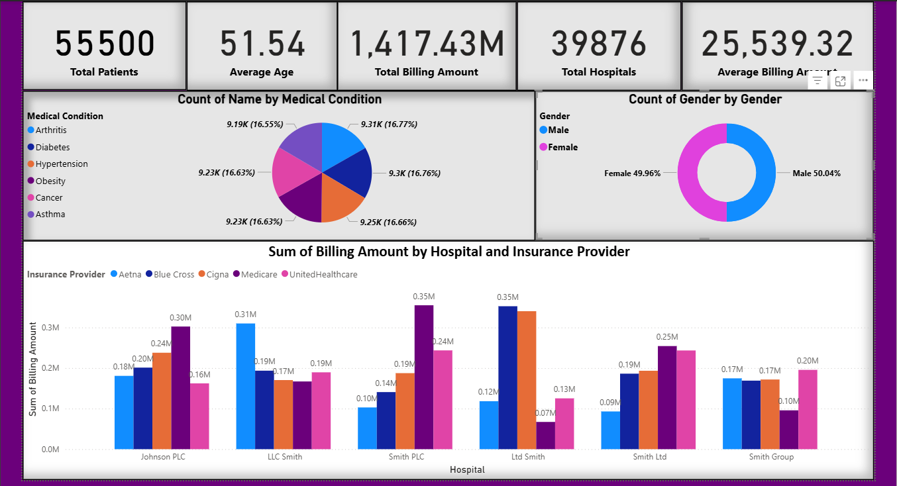

# 🏥 Power BI Healthcare Dashboard

A Power BI project analyzing healthcare data — covering patient demographics, billing analysis, and hospital-level insights.

---

## 📊 Project Overview

This dashboard provides an analytical view of hospital and patient data to help identify key patterns across:
- **Total patients and hospitals**
- **Average age and billing amount**
- **Gender distribution**
- **Top medical conditions**
- **Insurance provider performance**

---

## 🧠 Key Insights

- **Total Patients:** 55,500  
- **Average Age:** 51.54 years  
- **Total Billing Amount:** ₹1,417.43 Million  
- **Total Hospitals:** 39,876  
- **Average Billing:** ₹25,539.32  
- Gender distribution is **almost equal** — Male: 50.04% | Female: 49.96%  
- Common medical conditions are **evenly distributed**, indicating a balanced dataset.  

---

## 🧮 Tools & Skills Used

| Tool / Skill | Description |
|---------------|-------------|
| **Power BI** | Data visualization, dashboard creation |
| **DAX** | Calculations for KPIs like total billing, average billing, etc. |
| **Data Modeling** | Relationships built between multiple healthcare tables |
| **Excel / CSV** | Source dataset used for import |
| **Data Cleaning** | Null handling, renaming columns, data type adjustments |

---

## 📈 Dashboard Preview

---

## 🧩 Key Visuals in Dashboard

- **KPIs:** Total Patients, Hospitals, Billing Amount, and Average Age  
- **Pie Chart:** Distribution of patients by medical condition  
- **Donut Chart:** Gender distribution  
- **Clustered Column Chart:** Billing amount by hospital and insurance provider  

---

## 🗂️ Project Files

| File Name | Description |
|------------|-------------|
| `Hospital_Data_Dashboard.pbix` | Main Power BI project file |
| `Dashboard_Screenshot.png` | Dashboard preview image |

---

## 🧾 Author

👤 **Prabhat Saini**  
📍 Ghaziabad, Uttar Pradesh, India  
💼 Data Enthusiast | Power BI Learner  
🔗 [GitHub Profile](https://github.com/PrabhatSaini1996)

---

## 🚀 How to Use

1. Download the `.pbix` file from this repository.  
2. Open it in **Power BI Desktop**.  
3. Explore visuals, filters, and measures interactively.

---

⭐ If you liked this project, don’t forget to **star the repo** and **follow me on GitHub**!
